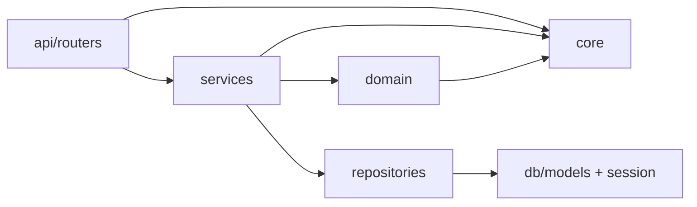

# Arquitetura — APP-GERENCIADOR-FINANCEIRO

Este documento descreve a arquitetura atual, os padrões adotados e regras práticas
para manter o código escalável, testável e consistente ao longo da evolução do MVP.

---

## 1) Visão geral (camadas)

O projeto segue uma arquitetura em camadas (Clean/Onion “light”), separando:

- **Interface (HTTP/API)**: FastAPI routers, validação de entrada e formatação de resposta
- **Application (Services / Use-cases)**: orquestração do caso de uso (transação, regras, repositórios)
- **Domain**: regras puras e Value Objects (sem I/O)
- **Infra / Persistence**: SQLAlchemy models, repositories, session/UoW
- **Cross-cutting (Core)**: config, logging, security, catálogo de mensagens/códigos e exceções

### Diagrama (dependências desejadas)

> Observação: o domínio ainda depende de `core` (ErrorMessage/DomainError) por pragmatismo de MVP
> e para manter contrato de erro estável. Em uma Clean Architecture estrita, o domínio não deveria
> conhecer status HTTP nem mensagens “de interface”.

---

## 2) Responsabilidades por camada

### 2.1 API (routers)
**Onde:** `src/app/api/routers/*`

**Responsabilidades**
- I/O HTTP: path/query/body, status code, response model
- Depedências FastAPI: `Depends(get_uow)`, `Depends(require_api_key)`
- Delegar para services e retornar o resultado

**Não deve**
- Fazer SQL/queries diretamente
- Implementar regra de negócio complexa
- Gerenciar commit/rollback

### 2.2 Services (use-cases)
**Onde:** `src/app/services/*`

**Responsabilidades**
- Orquestrar o caso de uso (ex.: criar transação, deletar transfer pair)
- Validar invariantes com regras puras do domínio (`domain/rules/*`)
- Consultar persistência via repositories
- Usar `uow.flush()` quando precisar de PK antes do commit final

**Não deve**
- Dar `commit()`/`rollback()` (responsabilidade do boundary: `get_uow`)
- Conter SQL ou detalhes de persistência complexos (delegar a repositories)
- Misturar HTTP concerns (ex.: `HTTPException`)

### 2.3 Domain (regras puras + VOs)
**Onde:** `src/app/domain/*`, `src/app/domain/rules/*`

**Responsabilidades**
- Regras e invariantes **sem I/O**
- Value Objects/helpers (ex.: dinheiro Decimal, parsing de mês)

**Boas práticas**
- Funções puras, fáceis de testar sem DB
- Mensagens/códigos estáveis para erros (quando aplicável)

### 2.4 Repositories
**Onde:** `src/app/repositories/*`

**Responsabilidades**
- Encapsular queries reutilizáveis e/ou complexas
- Receber `Session` e **não** dar commit

**Nota**
- Hoje parte dos repos usa `db.query()` (legado). Migrar gradualmente para estilo SQLAlchemy 2.0
  com `select()`/`session.execute()` é recomendado, mas não obrigatório para o MVP.

### 2.5 Unit of Work / Session
**Onde:** `src/app/db/uow.py`, `src/app/db/session.py`, `src/app/api/deps.py`

**Responsabilidade**
- Definir o boundary transacional por request/script
- Garantir commit em sucesso e rollback em erro

---

## 3) Padrões adotados

### 3.1 Unit of Work (UoW)
- DI fornece um `UnitOfWork` por request (`get_uow`)
- Commit/rollback centralizado na dependência (boundary)

### 3.2 Repository Pattern
- Queries em `repositories/*`
- Services usam repos para leitura/escrita

### 3.3 Contrato de erro (ProblemDetail)
- Erros de domínio (`DomainError`) são serializados para `ProblemDetail`
- `code` estável via `ErrorMessage` + `docs/ERROR_CATALOG.md`

### 3.4 Dinheiro como Decimal
- Evita float
- Pydantic serializa como string (`schemas/types.py`)
- Helpers centralizados em `domain/money.py` e reexport em `core/money.py`

---

## 4) Regras de dependência (guidelines)

Regras práticas para evitar acoplamento:

1. `api/*` pode importar `services`, `schemas`, `core`
2. `services/*` pode importar `domain`, `repositories`, `db/uow`, `core`
3. `domain/*` **não deve** importar `api` nem `repositories` nem `db`
4. `repositories/*` só conhece `db/models` e `Session`
5. `db/*` não depende de `api` nem `services`

---

## 5) Recomendações (roadmap técnico)

### Curto prazo (alto impacto / baixo risco)
- Expandir regras puras para outras áreas quando surgirem invariantes (accounts/categories)
- Criar testes unitários diretos para `domain/rules/*` (sem DB)

### Médio prazo
- Reduzir dependência `domain -> core` (se o projeto crescer):
  - criar exceções e “catalog” de erro no domínio
  - mapear para `ProblemDetail` no boundary/handler
- Migrar repos gradualmente para SQLAlchemy 2.0 style

### Longo prazo (se virar produto)
- Separar “Domain entities” de “ORM entities”
- Adicionar camadas explícitas `application/` e `infra/` (melhor governança)
- Observabilidade (correlation-id, tracing) e métricas
