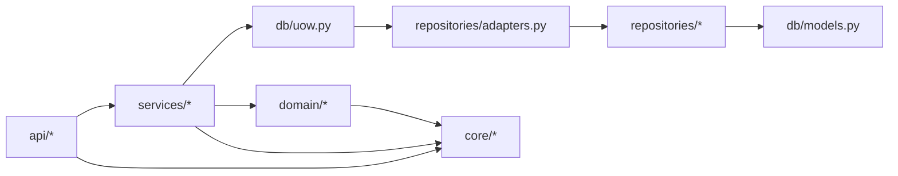

# Documentação Técnica Consolidada — APP‑GERENCIADOR‑FINANCEIRO

MVP de **API REST** para controle financeiro pessoal **single-user local**, construído com **FastAPI + SQLAlchemy + Alembic + Pydantic v2**, com foco em:
- regras de negócio explícitas (domínio),
- consistência de dinheiro (Decimal),
- transações corretas (Unit of Work),
- contrato de erro padronizado (ProblemDetail),
- testabilidade e proteção arquitetural (guardrails).

> Fontes primárias no repositório: `README.md`, `docs/ARCHITECTURE.md`, `docs/ARCH_REVIEW.md`, `docs/ERROR_CATALOG.md` e o código em `src/app/*`.

---

## Sumário

1. [Visão do Produto (Negócio)](#1-visão-do-produto-negócio)  
2. [Arquitetura (Camadas e Dependências)](#2-arquitetura-camadas-e-dependências)  
3. [Contrato da API (Endpoints, Auth, Erros)](#3-contrato-da-api-endpoints-auth-erros)  
4. [Estruturas de Dados (Domínio + Banco)](#4-estruturas-de-dados-domínio--banco)  
5. [Regras de Negócio (Invariantes)](#5-regras-de-negócio-invariantes)  
6. [Padrões e Boas Práticas Aplicadas](#6-padrões-e-boas-práticas-aplicadas)  
7. [Validação e Normalização (422 vs 400; dinheiro)](#7-validação-e-normalização-422-vs-400-dinheiro)  
8. [Observabilidade (Logging)](#8-observabilidade-logging)  
9. [Testes e Guardrails de Arquitetura](#9-testes-e-guardrails-de-arquitetura)  
10. [Evolução e Roadmap Técnico](#10-evolução-e-roadmap-técnico)  
11. [Avaliação Técnica (Qualidade)](#11-avaliação-técnica-qualidade)  

---

## 1. Visão do Produto (Negócio)

### 1.1 Problema que resolve
O sistema oferece uma API para registrar e analisar finanças pessoais com consistência:

- **Contas**: onde o dinheiro está (banco, carteira).
- **Categorias**: como o dinheiro é classificado (alimentação, salário etc.).
- **Transações**: receitas e despesas.
- **Transferências**: movimentações entre contas (modeladas como 2 transações).
- **Orçamentos (budgets)**: planejamento mensal por categoria (MVP: apenas despesas).
- **Relatórios**: resumo mensal com totalizadores e orçado vs realizado.

### 1.2 Escopo e limitações intencionais (MVP)
- **single-user** (não existe autenticação por usuário; apenas API key)
- **SQLite** local
- Sem UI (consumo via Swagger/Postman/clients)

---

## 2. Arquitetura (Camadas e Dependências)

O projeto segue Clean/Onion “light” (pragmático), com limites de responsabilidade bem definidos.

### 2.1 Diagrama de dependências (alto nível)



**Leitura recomendada**:
- `docs/ARCHITECTURE.md`: regras e responsabilidades por camada  
- `docs/ARCH_REVIEW.md`: análise crítica e recomendações  
- `tests/test_architecture.py`: “guardrails” que garantem essas regras

### 2.2 Responsabilidades por camada

#### API (`src/app/api/*`)
- **Routers**: I/O HTTP (query/body/path), response_model, status_code
- **Dependências**:
  - `require_api_key` (security)
  - `get_uow` (Unit of Work por request)
- **Não faz**: SQL, regras complexas, commit/rollback

Arquivos-chave:
- `src/app/main.py`: fábrica do FastAPI + handlers globais de erro
- `src/app/api/deps.py`: boundary transacional e verificação da API key
- `src/app/api/openapi.py`: utilitários para documentar erros (responses + exemplos)

#### Services (`src/app/services/*`)
- Camada de aplicação (use-cases): **orquestra** regras + persistência
- Depende de `UnitOfWork` e de **ports** (protocolos) expostos como `uow.accounts`, `uow.transactions`, etc.
- **Não faz commit/rollback** (isso é do boundary em `get_uow()`)

Exemplos:
- `services/transactions.py`: criação/listagem/remoção de transações e delegação de transfer
- `services/transfers.py`: criação de transferências (2 transações vinculadas)
- `services/budgets.py`: upsert de orçamento e validações
- `services/reports.py`: agregações do resumo mensal

#### Domain (`src/app/domain/*`)
- Regras puras (sem I/O)
- Catálogo de erros estáveis (código + mensagem)
- Value Objects / validações (mês, dinheiro)

Exemplos:
- `domain/rules/transactions.py`: invariantes de transação/transfer
- `domain/rules/budgets.py`: mês válido + somente EXPENSE no MVP
- `domain/rules/reports.py`: intervalo do mês (month_range)
- `domain/money.py`: Decimal + quantize + serialize
- `domain/errors.py`: exceções agnósticas de framework (DomainError + subclasses)

#### Infra/Persistence (`src/app/db/*`, `src/app/repositories/*`)
- ORM SQLAlchemy em `db/models.py`
- Sessão/engine em `db/session.py`
- Repositórios de queries em `repositories/*` (funções)
- Adapters OO em `repositories/adapters.py` implementando ports (protocolos do domínio)
- `db/uow.py`: UnitOfWork cria os adapters a partir da Session

---

## 3. Contrato da API (Endpoints, Auth, Erros)

### 3.1 Autenticação (API Key)
- Header: `X-API-Key`
- Controlado por:
  - `core/config.py`: `settings.api_key_enabled`, `settings.api_key`
  - `core/security.py`: `verify_api_key()` (usa `hmac.compare_digest`)
  - `api/deps.py`: `require_api_key()` (FastAPI Security dependency)

Regra:
- Se `API_KEY_ENABLED=false` → não exige header (modo dev)
- Se habilitado e inválido/ausente → **401** com `code="API_KEY_INVALID"`

### 3.2 Contrato de erro padronizado (ProblemDetail)
Schema:
- `src/app/schemas/errors.py` (`ProblemDetail`)
Handlers:
- `src/app/main.py`:
  - `@app.exception_handler(DomainError)` → converte erros de negócio para ProblemDetail
  - `@app.exception_handler(StarletteHTTPException)` → padroniza HTTPException
  - `@app.exception_handler(RequestValidationError)` → padroniza 422 (Pydantic)

Catálogo completo:
- `docs/ERROR_CATALOG.md`
- Enum “source of truth”: `src/app/domain/error_messages.py` (`ErrorMessage`)

### 3.3 Endpoints (por recurso)

> Observação: routers são “thin” e sempre recebem `uow: UnitOfWork = Depends(get_uow)`.

#### Health
- `GET /health` (sem API key)
  - response: `{"status":"ok"}`

#### Accounts
Arquivo: `src/app/api/routers/accounts.py`

- `GET /accounts?include_inactive=false`
  - lista contas; por padrão só ativas
- `POST /accounts`
  - body: `AccountCreate` (`schemas/accounts.py`)
  - cria conta (unicidade em `(name,type)`)
- `PUT /accounts/{account_id}`
  - body: `AccountUpdate`
  - atualiza campos e `active`
- `DELETE /accounts/{account_id}`
  - soft delete via `active=false`

Erros típicos:
- 409 `ACCOUNT_ALREADY_EXISTS`
- 404 `ACCOUNT_NOT_FOUND`

#### Categories
Arquivo: `src/app/api/routers/categories.py`

- `GET /categories?include_inactive=false`
- `POST /categories`
  - body: `CategoryCreate` (`kind` e `group` são enums)
- `PUT /categories/{category_id}`
  - body: `CategoryUpdate`
- `DELETE /categories/{category_id}`
  - soft delete (`active=false`)

Erros típicos:
- 409 `CATEGORY_ALREADY_EXISTS`
- 404 `CATEGORY_NOT_FOUND`

#### Transactions (INCOME/EXPENSE) e Transferências
Arquivo: `src/app/api/routers/transactions.py`

- `GET /transactions`
  - filtros: `from_date`, `to_date`, `account_id`, `category_id`, `kind`
  - regra: `from_date` e `to_date` devem vir juntos (senão 400)
- `POST /transactions`
  - body: `TransactionCreate`
  - regra: **não aceita** `kind=TRANSFER` (use `/transactions/transfer`)
- `POST /transactions/transfer`
  - body: `TransferCreate`
  - cria **duas** transações `TRANSFER` ligadas por `transfer_pair_id`
- `DELETE /transactions/{transaction_id}`
  - se `kind=TRANSFER` e tiver `transfer_pair_id`, remove o par inteiro

Erros típicos:
- 400 `TX_FROM_TO_BOTH_REQUIRED`
- 400 `TX_USE_TRANSFER_ENDPOINT`
- 400 `TX_INCOME_REQUIRES_AMOUNT_GT_0`, `TX_EXPENSE_REQUIRES_AMOUNT_LT_0`
- 400 `CATEGORY_INVALID_OR_INACTIVE`, `ACCOUNT_INVALID_OR_INACTIVE`
- 404 `TX_NOT_FOUND`
- 400 transfer: `TRANSFER_*`

#### Budgets
Arquivo: `src/app/api/routers/budgets.py`

- `GET /budgets?month=YYYY-MM`
- `POST /budgets` (upsert)
  - body: `BudgetUpsert`
  - cria ou atualiza orçamento para (month, category)
- `DELETE /budgets/{budget_id}`

Erros típicos:
- 400 `BUDGET_ONLY_EXPENSE_MVP`
- 400 `MONTH_*` (quando mês inválido em query)
- 404 `BUDGET_NOT_FOUND`

#### Reports
Arquivo: `src/app/api/routers/reports.py`

- `GET /reports/monthly-summary?month=YYYY-MM`
  - retorna `MonthlySummaryOut`
  - inclui:
    - totais de receita/despesa/saldo
    - breakdown por categoria: planned/realized/deviation

Erros típicos:
- 400 `MONTH_*` (mês inválido)

---

## 4. Estruturas de Dados (Domínio + Banco)

### 4.1 Domínio (Entities)
Domínio é representado por **dataclasses** (sem ORM), ex.:
- `domain/entities/transaction.py`: `Transaction(id, date, description, amount, kind, account_id, category_id, transfer_pair_id)`
- (há entidades equivalentes para account/category/budget em `domain/entities/*`)

Ponto importante:
- O domínio é “puro” (sem SQLAlchemy/FastAPI) e ideal para testes unitários.

### 4.2 Banco (SQLAlchemy ORM)
Arquivo: `src/app/db/models.py`

#### accounts
- `id` (PK)
- `name` (string 120)
- `type` (string 40, default "BANK")
- `active` (bool)
- `created_at` (datetime UTC naive)
- constraint: `UniqueConstraint(name, type)` → `uq_account_name_type`

#### categories
- `id`
- `name` (unique) → `uq_category_name`
- `kind` ("INCOME" | "EXPENSE")
- `group` ("ESSENTIAL" | "LIFESTYLE" | "FUTURE" | "OTHER")
- `active`

#### transactions
- `id`
- `date` (index)
- `description` (255)
- `amount` (Numeric(12,2), Decimal)
- `kind` ("INCOME" | "EXPENSE" | "TRANSFER")
- `account_id` (FK accounts, index)
- `category_id` (FK categories, index, nullable)
- `transfer_pair_id` (string 36, index, nullable)
- `created_at` (datetime UTC naive)

#### budgets
- `id`
- `month` (string 7 "YYYY-MM", index)
- `category_id` (FK categories, index)
- `amount_planned` (Numeric(12,2), Decimal)
- constraint: `UniqueConstraint(month, category_id)` → `uq_budget_month_category`

### 4.3 Engine e Session
Arquivo: `src/app/db/session.py`

- Engine é cacheado via `lru_cache(maxsize=1)` (um engine por processo).
- Para SQLite:
  - `check_same_thread=False` (permite uso em mais de uma thread no app)
  - PRAGMAs no connect:
    - `foreign_keys=ON` (SQLite não impõe FK por padrão)
    - `journal_mode=WAL` e `busy_timeout=5000` para reduzir “database is locked”

---

## 5. Regras de Negócio (Invariantes)

### 5.1 Transações INCOME/EXPENSE
Arquivo: `domain/rules/transactions.py` + `services/transactions.py`

Regras:
- `kind=TRANSFER` é proibido em `POST /transactions`  
  → erro 400 `TX_USE_TRANSFER_ENDPOINT`
- INCOME requer `amount > 0`  
  → erro 400 `TX_INCOME_REQUIRES_AMOUNT_GT_0`
- EXPENSE requer `amount < 0`  
  → erro 400 `TX_EXPENSE_REQUIRES_AMOUNT_LT_0`
- `category_id` é obrigatório para INCOME/EXPENSE  
  → erro 400 `TX_CATEGORY_ID_REQUIRED`
- conta deve existir e estar ativa  
  → erro 400 `ACCOUNT_INVALID_OR_INACTIVE`
- categoria deve existir, estar ativa e ser compatível com o kind  
  → erro 400 `CATEGORY_INVALID_OR_INACTIVE` ou `TX_CATEGORY_INCOMPATIBLE_*`

### 5.2 Transferências
Arquivo: `domain/rules/transactions.py` (`validate_new_transfer`) + `services/transfers.py` + `repositories/transactions.py`

Regras:
- `from_account_id != to_account_id`  
  → erro 400 `TRANSFER_SAME_ACCOUNTS`
- `amount_abs > 0`  
  → erro 400 `TRANSFER_AMOUNT_ABS_GT_0`
- conta origem/destino devem existir e estar ativas  
  → erro 400 `TRANSFER_FROM_ACCOUNT_INVALID` / `TRANSFER_TO_ACCOUNT_INVALID`

Persistência:
- gera **2 transações** com:
  - saída: `amount = -amount_abs`, `kind="TRANSFER"`, `account_id=from_account_id`, `category_id=None`
  - entrada: `amount = +amount_abs`, `kind="TRANSFER"`, `account_id=to_account_id`, `category_id=None`
- vínculo por `transfer_pair_id` (UUID) (gerado em `domain/ids.py`)

Exclusão:
- deletar uma transação de transferência remove o par inteiro (`delete_transfer_pair`)

### 5.3 Orçamentos (Budgets)
Arquivo: `domain/rules/budgets.py` + `services/budgets.py`

Regras:
- `month` precisa ser válido (YYYY-MM, mês 1..12, ano 1900..3000)
  - em **query**: retorna 400 com códigos `MONTH_*`
  - em **body** (schema): tende a gerar 422 se não bater pattern, e também há validador chamando `parse_month_str`
- categoria deve existir e estar ativa  
  → erro 400 `CATEGORY_INVALID_OR_INACTIVE`
- MVP: orçamento somente para categoria `EXPENSE`  
  → erro 400 `BUDGET_ONLY_EXPENSE_MVP`
- upsert em (month, category_id): garante 1 orçamento por categoria/mês

### 5.4 Relatório Mensal (Monthly Summary)
Arquivo: `domain/rules/reports.py` + `services/reports.py`

Regras/definições:
- valida `month` e calcula intervalo [primeiro dia, último dia] do mês
- soma:
  - `income_total` (somatório de INCOME no período)
  - `expense_total_signed` (somatório de EXPENSE no período, negativo)
- `expense_total` é retornado como **valor absoluto** (positivo)
- `balance = income_total + expense_total_signed` (portanto balance pode ser negativo)
- breakdown por categoria (união do que foi planejado + realizado):
  - `planned`: orçamento do mês
  - `realized`: **abs** do gasto realizado
  - `deviation = realized - planned` (pode ser negativo)

---

## 6. Padrões e Boas Práticas Aplicadas

### 6.1 Unit of Work (boundary transacional)
Arquivo: `api/deps.py` (`get_uow`) + `db/uow.py`

- `get_uow()` cria session, injeta `UnitOfWork`, e garante:
  - commit ao final do request com sucesso
  - rollback em qualquer exceção (inclui DomainError)
- Services não chamam commit/rollback (há teste impedindo isso)

### 6.2 Ports & Adapters (Protocol + SQLAlchemy implementation)
- Ports: `domain/ports/*` (ex.: `TransactionRepository`)
- Adapters: `repositories/adapters.py` (ex.: `SqlAlchemyTransactionRepository`)
- UoW cria adapters em `__post_init__`

Resultado:
- services dependem de **interfaces** (Protocol), e não de SQLAlchemy diretamente.

### 6.3 Repository Pattern
- Repositórios “function-based” em `repositories/*` (ex.: `repositories/transactions.py`)
- Encapsulam queries SQLAlchemy (preferindo estilo 2.0 com `select/delete` + `Session.scalars/execute`)

### 6.4 Contrato de erro estável (ProblemDetail + catálogo)
- `ProblemDetail` padroniza payload e evita formatos inconsistentes
- `ErrorMessage` dá previsibilidade ao `code` (bom para clients, QA e observabilidade)
- `api/openapi.py` injeta exemplos e respostas comuns no Swagger

### 6.5 Compatibilidade via “shims” (migração incremental)
Existem módulos “compatibility shim” em `core/*` que reexportam implementações do domínio:
- `core/exceptions.py` → reexporta `domain/errors.py`
- `core/error_messages.py` → reexporta `domain/error_messages.py`
- `core/money.py` → reexporta `domain/money.py`
- `core/validators.py` → reexporta `domain/validators.py`

Objetivo: evitar refactor ruidoso enquanto a base evolui.

---

## 7. Validação e Normalização (422 vs 400; dinheiro)

### 7.1 422 (Pydantic) vs 400 (Domínio)
- **422 Unprocessable Entity**: validação estrutural do schema (tipos, campos obrigatórios, constraints como `gt=0`)
- **400 Bad Request**: regra de negócio e validações “manuais”/domínio (ex.: from_date/to_date juntos, compatibilidade categoria, mês inválido vindo de query)

Isso é intencional e documentado em `README.md` e no `ERROR_CATALOG.md`.

### 7.2 Dinheiro como Decimal (contrato string)
Arquivos:
- `domain/money.py`: conversão segura + quantização + serialização
- `schemas/types.py`: `MoneyDecimal` com:
  - `BeforeValidator`: converte e quantiza
  - `PlainSerializer`: serializa sempre como **string** no JSON

Vantagens:
- evita float (precisão)
- payload consistente (`"5000.00"`, `"-150.50"`)

---

## 8. Observabilidade (Logging)

Arquivo: `core/logging.py` + inicialização em `main.py`

- Logging em JSON (um evento por linha) com:
  - timestamp UTC (`ts`)
  - nível (`level`)
  - logger
  - mensagem
  - stacktrace quando houver exceção (`exc_info`)

Config:
- `settings.log_level` via `.env` (`core/config.py`)

---

## 9. Testes e Guardrails de Arquitetura

Arquivos:
- `tests/test_architecture.py` (guardrails)
- demais testes de API/domínio em `tests/*`

### 9.1 Guardrails (o que garantem)
`test_layer_dependencies()` impede imports proibidos por camada, por exemplo:
- domain não importa FastAPI/SQLAlchemy/api/services/repos/db/core (regra forte no projeto)
- services não importam FastAPI (mantém caso de uso “HTTP-free”)
- api não importa repositories/SQLAlchemy (routers chamam services)

`test_no_commit_or_rollback_outside_boundary()` impede `.commit(` e `.rollback(` em services/repositories.

### 9.2 Benefícios práticos
- reduz regressões arquiteturais conforme o time cresce
- evita “bola de lama” (acoplamento incremental)
- mantém a base pronta para evoluções (Postgres, multi-user, features)

---

## 10. Evolução e Roadmap Técnico

Baseado em `docs/ARCH_REVIEW.md` e no desenho atual:

### Curto prazo (alto impacto / baixo risco)
- expandir regras puras do domínio para invariantes novas conforme surgirem
- manter routers thin e services sem commit/rollback (já garantido por testes)

### Médio prazo
- reduzir dependência Domain → Core (quando shims deixarem de ser necessários)
- migração gradual de repos para SQLAlchemy 2.0 style (já ocorre em `repositories/transactions.py`)

### Longo prazo (se virar produto)
- separar entidades de domínio vs entidades ORM (mappers)
- Postgres + migração de concorrência
- observabilidade avançada (correlation-id, métricas, tracing)

---

## 11. Avaliação Técnica (Qualidade)

### 11.1 Pontos fortes (padrões de mercado)
- Boundary transacional correto (UoW por request)
- Contrato de erro padronizado e documentado
- Dinheiro como Decimal + contrato string (muito sólido)
- Separação clara API/Services/Domain/Infra
- OpenAPI com respostas comuns e exemplos realistas
- Guardrails de arquitetura (excelente prática para projetos pequenos/médios)

### 11.2 Pontos de atenção (trade-offs do MVP)
- SQLite (limitações de concorrência; mitigado parcialmente com WAL + busy_timeout)
- Existem shims em `core/*` (ok para migração incremental; pode ser removido no futuro)
- Domínio ainda tem regras “procedurais” (funções em rules) — totalmente aceitável no MVP; pode evoluir para comportamento em entidades/VOs se necessário

### 11.3 Score sugerido (visão técnica)
**9.4 / 10** para um MVP local.

Motivo: a base é muito sólida (arquitetura, testes, contrato), e o principal “desconto” é por escolhas intencionais de escopo (SQLite/single-user) e pelo uso de shims enquanto a arquitetura se estabiliza.

---

## Apêndice A — Arquivos-chave (mapa rápido)

- App/Bootstrap
  - `src/app/main.py`
- API
  - `src/app/api/deps.py`
  - `src/app/api/openapi.py`
  - `src/app/api/routers/*.py`
- Core (cross-cutting)
  - `src/app/core/config.py`
  - `src/app/core/security.py`
  - `src/app/core/logging.py`
  - `src/app/core/{money,validators,error_messages,exceptions}.py` (shims)
- Domain
  - `src/app/domain/errors.py`
  - `src/app/domain/error_messages.py`
  - `src/app/domain/money.py`
  - `src/app/domain/validators.py`
  - `src/app/domain/rules/*`
  - `src/app/domain/entities/*`
  - `src/app/domain/ports/*`
- Infra/Persistence
  - `src/app/db/models.py`
  - `src/app/db/session.py`
  - `src/app/db/uow.py`
  - `src/app/repositories/*`
  - `src/app/repositories/adapters.py`
- Testes
  - `tests/test_architecture.py`

---

## Apêndice B — Fluxo típico de request (HTTP → DB → response)

```mermaid
sequenceDiagram
  autonumber
  participant Client
  participant API as FastAPI Router
  participant Deps as api/deps.get_uow
  participant SVC as Service (use-case)
  participant UOW as UnitOfWork
  participant Repo as Repository Adapter/Functions
  participant DB as SQLite (via SQLAlchemy)

  Client->>API: Request + X-API-Key
  API->>Deps: Depends(require_api_key) + Depends(get_uow)
  Deps->>UOW: cria Session + UnitOfWork
  API->>SVC: chama caso de uso com uow + payload
  SVC->>Repo: uow.* (ports/adapters)
  Repo->>DB: select/insert/update/delete
  Repo-->>SVC: entidades de domínio (dataclasses)
  SVC-->>API: resultado
  API-->>Deps: request finaliza sem exceção
  Deps->>DB: commit
  API-->>Client: 2xx + response_model

  alt exceção DomainError/HTTPException/Validation
    SVC-->>API: levanta DomainError
    API-->>Client: ProblemDetail (handler global)
    API-->>Deps: exceção propaga
    Deps->>DB: rollback
  end
